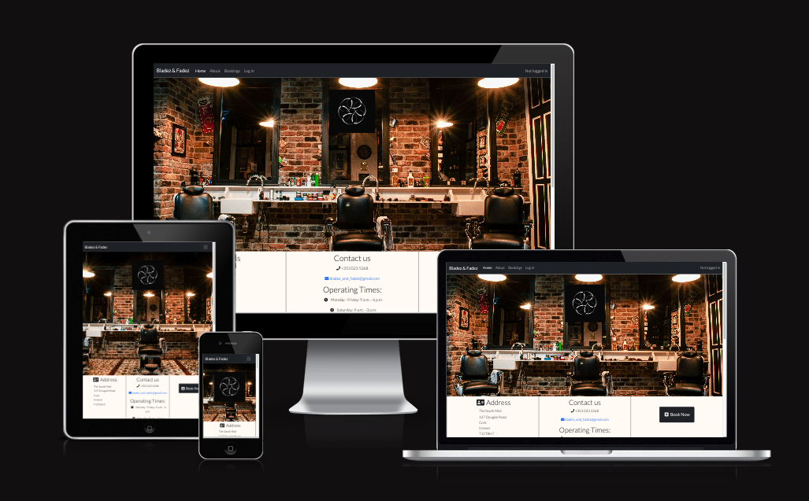
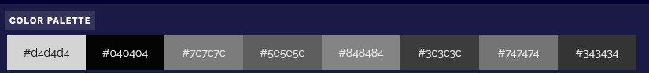
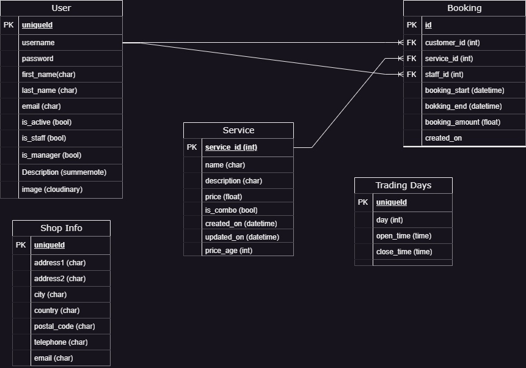

# Portfolio Project 4

## Django Barber Shop - A booking system created for the Bladez and Fadez Barber Shop

The booking system was created as a simple way for customers to make and manage their bookings with the shop.

### Making a booking is this simple!
1. Login to the system
2. Click on Make booking
3. Select your desired date
4. Select your staff member
5. Select your timeslot
6. Select the service you want

### Live Site

[Go to application](https://django-barber-shop-fd0b7d4f3e18.herokuapp.com/)

### Repository

[View repository](https://github.com/jayleighton/django-barber-shop)

## Contents

## User Experience (UX)

From a personal standpoint, I don't like going to a barber and having to sit in a queue for an hour or more for a haircut.
I created this booking system as an alternative to that paradigm in which I can make a booking that suits my timeline without having to join a queue of customers walking in off the street.

### User Stories
The following user stories are applicable to the creation of the website.
- As a user I want to register an account in order to make bookings
- As an administrator I want to do be able to update information on staff to automatically update the about page which is visible to customers
- As a user I want to do be able to view information about the shop including addresses and telephone numbers
- As an administrator I want to do be able to add and update trading days for customer bookings
- As an administrator I want to do admin functionality to be disabled for standard user to prevent unwanted changes
- As an administrator I want to do add, edit, update and delete services that customers can select
- As a user I want to do have access to see information about the professionals employed in the barber shop to decide who I will book with
- As a user I want to do view a list of past and upcoming bookings
- As a manager I want to do view bookings for all staff to schedule work
- As a staff member I want to do see bookings I have for the current day when logging in to plan my day
- As a customer I want to do update my profile information to keep my details up to date
- As a user I want to do be able to make a booking for a specific service with a specific professional
- As a user I want to do be able to cancel an upcoming booking

The user stories are split into categories by user role as follows:

#### First Time Visitor Goals
- To immediately understand that the site is for a barber shop.
- It must be immediately clear that a booking service is available
- Ability to view available services that can be booked
- Ability to see information about the shop and the staff available for bookings
- Ability to register and account on the website

#### Returning Visitor Goals
- Ability to view upcoming bookings
- Ability to cancel bookings that do meet my availability and book additional appointments
- Update my user profile

#### Staff Goals
- Ability to see bookings that are pending
- Ability to see services available for booking
- View of any upcoming bookings for the current day

#### Manager/Administrator Goals
- Ability to add and update staff members
- Ability to add and update available services
- Ability to update store address and contact information
- Ability to view bookings for all staff members for a week in advance

## Design

### Colour Palette
The colour palette was extracted from the base logo using [PineTools](https://pinetools.com/get-colors-image)

### Imagery
The imagery on the website is intended to clearly show the services available to potential customers and also to provide a sense of satisfaction that the customers in the images are experiencing.

### Wireframes

Wireframes were created for each page on a desktop display
- [Wireframe Export](documentation/wireframes/wireframe_export.pdf)

### Database Design
The entity relationship diagram includes the relevant models and structure.

### Typography

## Features

### General Features

### Accessibility

## Technology Stack Used

### Languages Used

### Frameworks, Libraries and Programs Used

## Deployment & Local Development

### Heroku Deployment

### Local Development

#### How to fork the repository

#### How to clone the repository

## Testing

## Credits

### Code Credits

### Content Credits

### Media Credits

